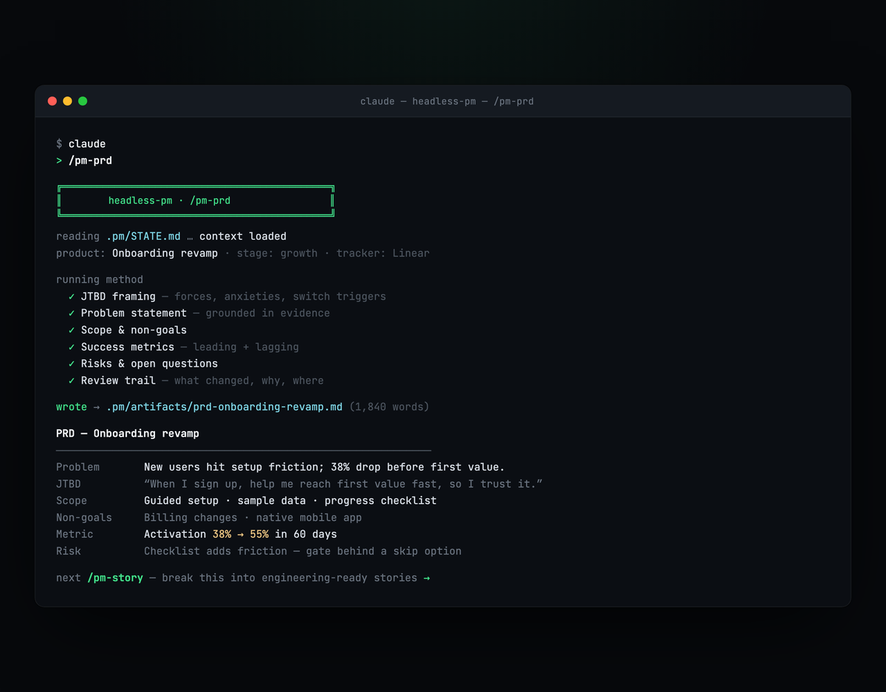
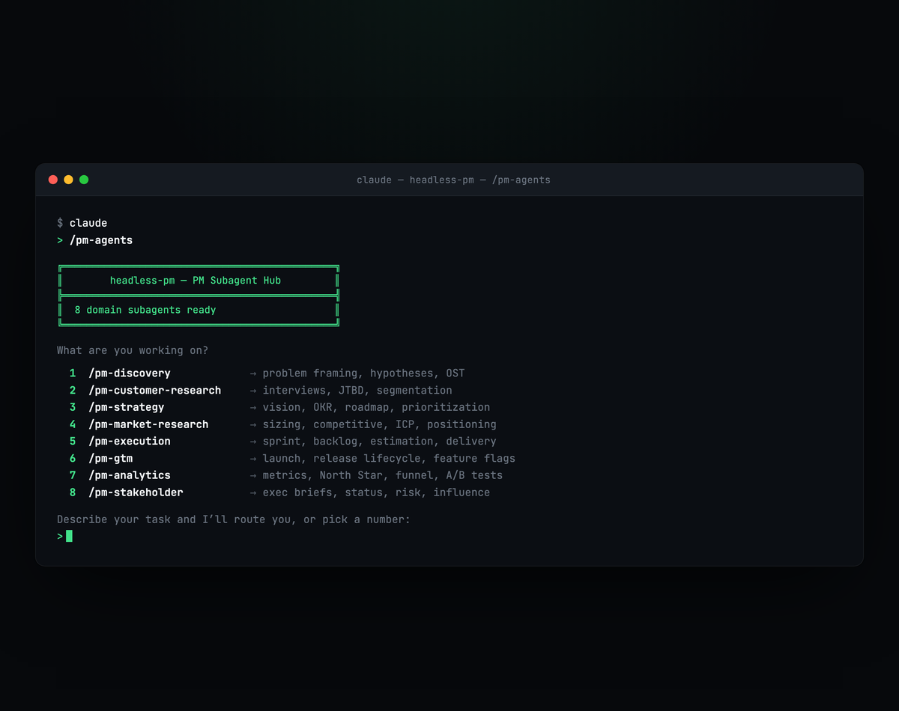

# headless-pm



[](https://www.npmjs.com/package/headless-pm)
[](https://www.npmjs.com/package/headless-pm)
[](LICENSE)
[](https://github.com/amrekansky/headless-pm)

**An AI workflow system for product managers — 100+ PM workflows in your terminal.**

`headless-pm` installs discovery, PRDs, roadmaps, sprints, GTM, analytics, and stakeholder workflows into Claude, Codex, or Gemini. Every output lands in your own files. Free to install, yours to keep.

```bash
npx headless-pm install
```

Run `/pm-onboarding` (8 questions) and your first brief, PRD, or sprint plan is minutes away.

> **Stop re-prompting from scratch.** Run the same PM workflow — same method, same checks, same output shape — every time, on Claude, Codex, or Gemini.

---

## Start in two minutes

```bash
npx headless-pm install      # auto-detects Claude Code / Gemini CLI / Codex CLI
```

```
/pm-onboarding               # 8 questions → your .pm/STATE.md workspace
/pm-prd                      # ...then run any of 100+ skills
```

No setup beyond your AI assistant. New to the terminal? → **[Getting Started](docs/getting-started.md)** walks you from zero to your first run.

<details>
<summary><b>No terminal? Install in Claude Cowork</b></summary>

<br>

Run headless-pm inside Claude Desktop — no command line:

1. Open **Customize** (bottom-left in Claude Desktop)
2. **Browse plugins** → **Personal** → **+**
3. **Add marketplace from GitHub**
4. Enter: `amrekansky/headless-pm`

All 9 PM plugins install automatically — `/pm-discovery`, `/pm-execution`, `/pm-customer-research`, and 6 more, right in your chat. → [Getting Started in Cowork](COWORK.md)

</details>

---

## Why PMs keep it installed

It's not a prompt pack. It's a maintained system with real depth:

- **100+ skills across 8 domains** — discovery, customer research, strategy, market research, execution, GTM, analytics, stakeholder. Not snippets — full workflows with steps, checks, and an output you can ship.
- **8 domain subagents** — `/discovery`, `/customer-research`, `/strategy`, `/market-research`, `/execution`, `/gtm`, `/analytics`, `/stakeholder`. Each routes to the right skill or runs a full sequence. `/pm-agents` finds it for you.
- **Real methodology, built in** — proven PM frameworks walked step by step, not generic prompts (see [Built on real methodology](#built-on-real-methodology)).
- **A workspace that remembers** — `.pm/` keeps your goals, decisions, risks, open questions, and stakeholders across sessions. No re-explaining the project every time.
- **Connects to your stack** — Notion, Linear, Jira, Miro, Exa, Google Sheets, Figma, Slack, GitHub via MCP.
- **Cross-linked end to end** — every skill points to the next. `/pm-hypothesis` → `/brainstorm-experiments` → `/pm-ab`. No dead ends.
- **Runs on Claude, Codex, or Gemini — natively** — not Claude-only. Use whichever CLI your team already has.

---

## What a workflow actually produces

Each skill runs a real method and hands you a finished artifact — not a wall of text to clean up:



| Run this | And you get |
|---|---|
| `/pm-prd` | JTBD framing, problem statement, scope, success metrics — a full, engineering-ready PRD |
| `/pm-discovery` | problem framing, hypotheses, an opportunity-solution tree, assumption map, and an experiment plan |
| `/cusdev` | a Mom Test interview guide, then synthesis — themes, JTBD forces, and an evidence map |
| `/pm-roadmap` | OKR-aligned Now / Next / Later, dependencies, and exec / eng / customer views |
| `/pm-competitive` | battlecards, positioning gaps, and a feature-and-pricing teardown |

Every output lands as plain markdown in your `.pm/` workspace, with the checks and review trail attached.

---

## Built on real methodology

Every workflow encodes a named PM framework — Continuous Discovery (Teresa Torres), Jobs-to-be-Done (Christensen, Ulwick), positioning (April Dunford), 7 Powers (Hamilton Helmer), Shape Up, Lean Startup — walked step by step, not improvised.

Made by a product manager, for product managers.

---

## Safe to try

- **Free** — every skill installs free. No card, no trial clock.
- **Local-first** — it runs in your terminal and writes to your files. Nothing is uploaded to us.
- **Bring your own AI** — your Claude, Codex, or Gemini, your tokens. We don't sit in the middle.
- **No lock-in** — outputs are plain markdown in your repo, and the skills are open files you can read and edit.

---

## Built for your kind of PM

- **OPS** — operations, delivery, process, incidents
- **GRW** — growth, funnels, experiments, metrics
- **PRD** — discovery, definition, roadmaps, specs
- **TEC** — technical PM, platform, dependencies
- **PLT** — platform and ecosystem strategy

Five personas, one toolkit. Start with the skill that matches today's task.

---

## First run

Open Claude Code (or Gemini CLI / Codex) in your project and let the hub route you:



Common starters: `/pm-sprint-plan` · `/pm-prd` · `/pm-discovery` · `/cusdev` · `/pm-roadmap`. Skills work with or without a `.pm/STATE.md`.

---

## When one command beats picking from a hundred → `/pm`

Once headless-pm is part of your week, the `/pm` orchestrator removes the last step of friction. It reads your `.pm/STATE.md`, routes to the right skill automatically, and coordinates the subagents — no menus, no manual selection. Just `/pm`, and it picks up where you left off.

```bash
npx headless-pm setup --key=YOUR-KEY
```

$60/yr. → **[headlesspm.com](https://headlesspm.com)**

---

<details>
<summary><b>All skills — full category list</b></summary>

<br>

| Category | Skills |
|---|---|
| Domain Subagents | `/discovery`, `/customer-research`, `/strategy`, `/market-research`, `/execution`, `/gtm`, `/analytics`, `/stakeholder`, `/pm-agents` |
| Orchestrator | `/pm` _(paid)_ |
| Customer Development | `/cusdev`, `/switch-interview`, `/continuous-interview-synthesis` |
| Discovery & Research | `/pm-discover`, `/pm-discovery`, `/pm-define`, `/pm-hypothesis`, `/pm-learn`, `/pm-market`, `/pm-cjm`, `/opportunity-solution-tree` |
| JTBD & Segmentation | `/pm-jtbd`, `/pm-persona`, `/attitudinal-segmentation`, `/user-segmentation`, `/jtbd-interview`, `/pm-segmentation-synthesis` |
| Survey & Feedback | `/pm-survey`, `/pm-nps-csat`, `/feedback-triage`, `/pm-cluster` |
| Definition & Spec | `/pm-prd`, `/pm-story`, `/pm-epic`, `/pm-acceptance`, `/pm-brief` |
| Sprint & Delivery | `/pm-sprint`, `/pm-sprint-plan`, `/pm-backlog`, `/pm-capacity`, `/pm-estimation`, `/pm-dependencies`, `/pm-kickoff`, `/pm-standup`, `/pm-status`, `/pm-demo`, `/pm-retro`, `/pm-save` |
| Strategy | `/strategy-stack`, `/vision-setting`, `/product-work-levels`, `/ansoff-matrix`, `/swot-analysis`, `/pestle-analysis`, `/pm-radar` |
| OKR & Roadmap | `/pm-okr`, `/pm-roadmap`, `/pm-portfolio`, `/pm-prioritize`, `/pm-plan` |
| Market & Sizing | `/tam-sizing`, `/market-sizing`, `/beachhead-mapping` |
| Positioning & Messaging | `/positioning-five-component`, `/icp-definition`, `/messaging-hierarchy`, `/pm-positioning`, `/competitive-battlecard` |
| Competitive | `/pm-competitive`, `/pm-competitive-synthesis` |
| GTM & Launch | `/pm-gtm`, `/pm-launch`, `/pm-feature-flags`, `/pm-release`, `/pm-release-lifecycle`, `/pm-pricing-changes` |
| Stakeholder & Comms | `/pm-stakeholder`, `/pm-exec-brief`, `/risk-escalation`, `/audience-tailoring`, `/weekly-digest`, `/influence-without-authority` |
| Metrics & Analytics | `/pm-metrics`, `/north-star-selection`, `/funnel-analysis`, `/dashboard-structuring`, `/pm-ab`, `/pm-adoption`, `/pm-customer-health`, `/pm-analyst`, `/growth-loops` |
| Experiments & Risk | `/assumption-mapping`, `/brainstorm-experiments`, `/lean-canvas`, `/pre-mortem`, `/pm-decision` |
| Ops & Incidents | `/pm-incident-response`, `/pm-postmortem`, `/pm-sla-slo`, `/pm-sunset-deprecation` |

</details>

<details>
<summary><b>Connect your tools (MCP)</b></summary>

<br>

MCP setup runs automatically during install. You'll see a checkbox list — select the tools you use.

**Notion**
1. Go to [notion.so/my-integrations](https://www.notion.so/my-integrations) → **New integration**
2. Copy the **Internal Integration Token**
3. Share relevant pages with your integration (open page → `...` → Connections → your integration)

**Linear / Jira / Google Sheets / Figma / Slack / GitHub** — OAuth, no API key needed. A browser window opens on first use.

**Miro** — OAuth, no API key needed.

> **Write access:** The OAuth flow is read-only. For write operations (creating cards, updating boards), generate a personal access token with `boards:write` scope at [miro.com/app/settings/user-profile/apps](https://miro.com/app/settings/user-profile/apps) and set it as `MIRO_TOKEN` in your environment.

**Exa** — AI-powered web search. After install you'll see setup instructions to add your API key. Get one at [exa.ai/settings/api-keys](https://exa.ai/settings/api-keys).

</details>

<details>
<summary><b>The <code>.pm/</code> workspace</b></summary>

<br>

`npx headless-pm install` creates a `.pm/` directory in your project — your persistent PM workspace, context that carries across sessions.

```
.pm/
├── STATE.md           # Current sprint, phase, focus, blockers
├── situation.md       # Situational snapshot from pm-radar
├── goals.md           # Product goals and OKRs
├── decisions.md       # Decision log with [verbal/documented/intuition] tags
├── risks.md           # Active, mitigated, and closed risks
├── open-questions.md  # Open questions with due dates
├── BRIEF.md           # Latest stakeholder brief (written by /pm-brief)
├── REVIEW.md          # Latest workspace health export (written by /pm-review)
├── stakeholders/      # One file per stakeholder — attitude, history, open asks
│   └── {name}.md
├── artifacts/         # PRDs, sprint plans, research outputs, retros
│   └── *.md
├── config.json        # Workspace config (sprint cadence, team name)
└── manifest.json      # Installed skill manifest (used for updates)
```

The `/pm` orchestrator reads this workspace on every invocation — no context re-entry needed. Its opening dashboard flags risks, questions, and briefs as they go stale.

</details>

<details>
<summary><b>CLI commands</b></summary>

<br>

```bash
npx headless-pm install              # Install skills + tools + MCP setup
npx headless-pm setup --key=YOUR-KEY # Unlock the /pm orchestrator with a license key
npx headless-pm mcp                  # Re-run MCP setup
npx headless-pm mcp --list           # List available MCP servers
npx headless-pm list                 # List installed skills and tools
npx headless-pm update               # Update to the latest version
```

</details>

<details>
<summary><b>What's new</b></summary>

<br>

**Latest — PM workspace memory layer**
- `/pm` opening dashboard shows staleness reminders for `/pm-brief` and `/pm-review`
- `/pm-chat` — pour out meeting notes, decisions, and risks in one message; the right `.pm/` file gets updated for you
- `/pm-review` — weekly workspace health sweep: stale risks, overdue questions, unimplemented decisions, stakeholders without recent contact
- `.pm/` memory layer now created on install: `decisions.md`, `risks.md`, `open-questions.md`, `stakeholders/`

**Earlier highlights**
- All PM skills free — only the `/pm` orchestrator needs a license
- 8 domain subagents + the `/pm-agents` hub
- Full cross-link graph — every workflow chain is navigable end-to-end
- Methodology knowledge base — 7 Powers, JTBD, Dunford positioning, North Star, and more

</details>

---

Made for product managers. Free to install, yours to keep.
If it saves you an afternoon, **⭐ the repo** — it helps other PMs find it.

[Getting Started](docs/getting-started.md) · [headlesspm.com](https://headlesspm.com) · License: FSL-1.1-MIT
